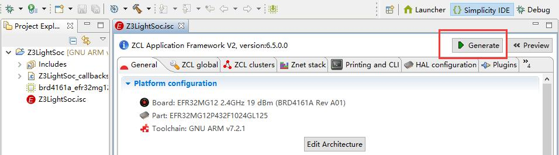
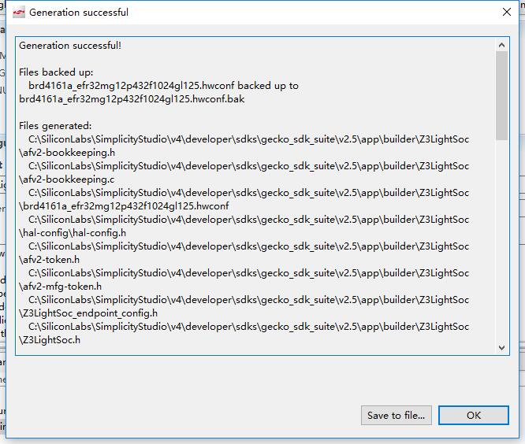

# 使用 App Builder 构建 EmberZNet 示例应用

本文记述了 EmberZNet 示例应用（Z3Light）的构建过程，并以此来介绍如何使用 App Builder 构建一个 EmberZNet 示例应用。

# 1. 创建 ISC 文件

1. 打开 Simplicity Studio，选择 `File > New > Project`。

    
 New > Project"> New > Project"/>

2. 在弹出的 `New Project` 窗口中，选中其中的 `Silicon Labs AppBuilder Project`，并点击 `Next`。

    

3. 在弹出的 `Applications` 窗口中，选中其中的 `ZCL Application Framework V2`，并点击 `Next`。

    

4. 在弹出的 `Stacks` 窗口中，选中其中的 `EmberZNet 6.5.0.0 GA SoC 6.5.0.0`，并点击 `Next`。

    

5. 在弹出的 `Select Application` 窗口中，选中其中的 `Z3Light`，并点击 `Next`。
   
    

6. 在弹出的 `Project Configuration` 窗口中，填写项目名，并点击 `Next`。

    > 注意，项目名只能使用英文字母、阿拉伯数字和下划线命名，并且应该以英文字母开头。

    

7. 在弹出的 `Project setup` 窗口中，选择核心板/模块型号、部件型号和工具链，并点击 `Finish`。

    > 注意，非官方板无需填选板型号；工具链建议只选择一种，否则可能会导致某些错误。

    

此时，可以在项目管理器下找到刚创建出来的 isc 文件，其被命名为 `<Project name>.isc`。

# 2. 生成项目文件

1. 打开所创建目录下的 `<Project name>.isc`，并点击 `Generate` 来生成项目文件。

    

2. 在弹出的 `Generation validation` 窗口中，勾选 `Overwrite`，并点击 `Ok`。

    

3. 在弹出的 `Generation successful` 窗口中，点击 `Ok`。 

    

此时，App Builder 已经成功地生成文件，你可以在项目管理器下找到新生成的项目文件。

# 3. 编译项目文件    

1. 选中项目，并点击下图中的 “锤子” 按钮以编译项目文件。
   
   

2. 等待编译完成，然后可以在 Simplicity Studio 的 `Console` 窗口中查看编译结果，下图表示编译成功。

    > 注意，若编译失败，大概率是因为你的项目名过长或 Simplicity Studio 的安装路径有误（即非默认路径）。

   

此时，项目文件已编译成功。

# 4. 调试应用

1. 选中项目，并点击下图中的 “虫子” 按钮以加载应用到设备上，并调试应用。
   
   > 注意，如果你有多个设备连接到 Simplicity Studio，则此时会弹出设备选择窗口，你需要选择你要调试的设备。

   

2. 应用将加载到设备上，并且设备将进入调试模式，如下图所示，点击 “运行” 按钮可使应用运行起来。
   
   

至此，你已经基本了解到示例应用的构建过程。
