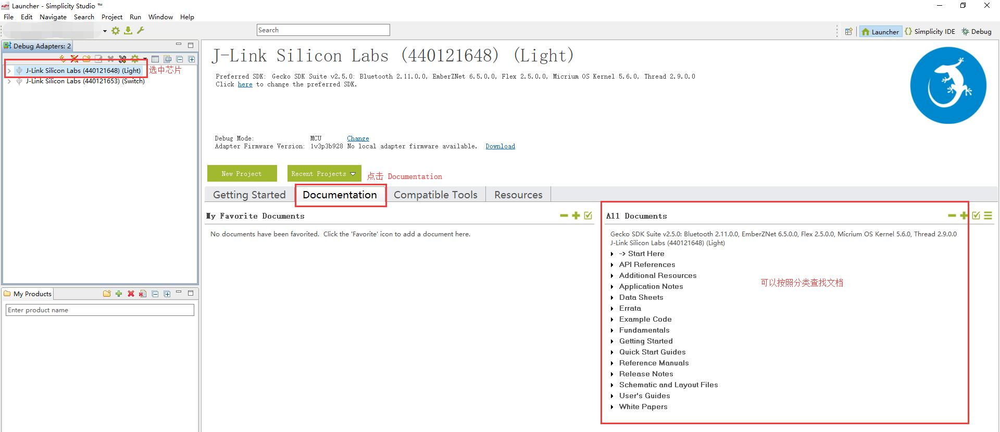
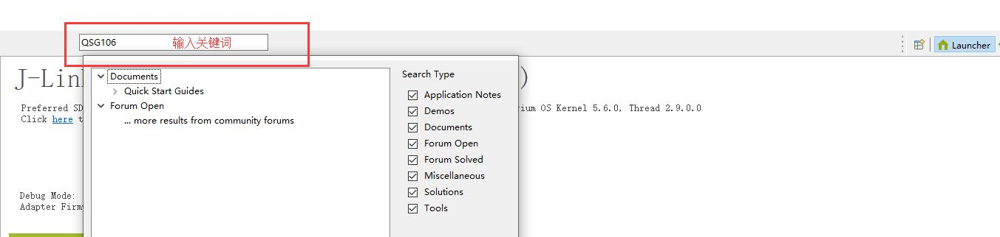

# 查找 EmberZNet 中的文档

本文介绍了如何查找 EmberZNet 中的文档。

# 1. 在 Simplicity Studio 中查找

在连接了芯片（如 EFR32）的情况下，可以在 Simplicity Studio 的 `Launcher` 界面内，在 `Debug Adapters` 窗口中选中芯片，即可的 `Documentation` 窗口中找到与所选芯片相关的几乎一切文档。

<div align=center title="Documentation"></div>

你也可以在  Simplicity Studio 的 `Launcher` 界面内的 `Search` 搜索框中输入关键词来找到相关文档。

<div align=center title="Search"></div>

# 2. 在 EmberZNet 的安装目录下查找

Windows 操作系统下，如果你在安装 Simplicity Studio 时使用了默认路径，则你可以在如下路径中找到 EmberZNet 的相关文档：

```
C:\SiliconLabs\SimplicityStudio\v4\developer\sdks\gecko_sdk_suite\v2.5\protocol\zigbee\documentation
```

如果你在安装 Simplicity Studio 时使用的是自己定义的路径（Linux 系统下也可以参考该路径），则你可以根据如下路径规则找到 EmberZNet 的相关文档：

```
<path>\SiliconLabs\SimplicityStudio\v4\developer\sdks\gecko_sdk_suite\v2.5\protocol\zigbee\documentation
```
