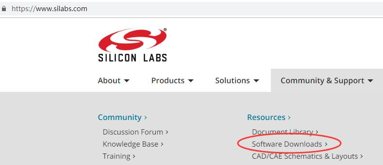
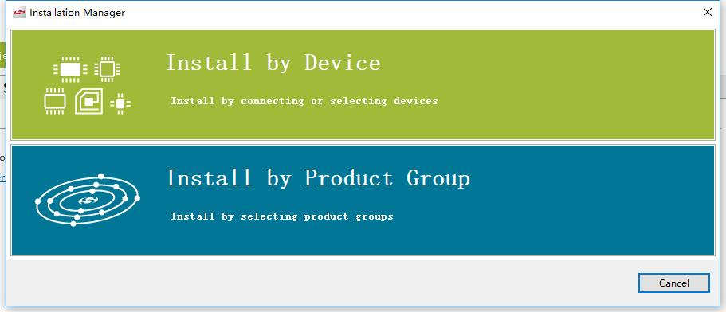
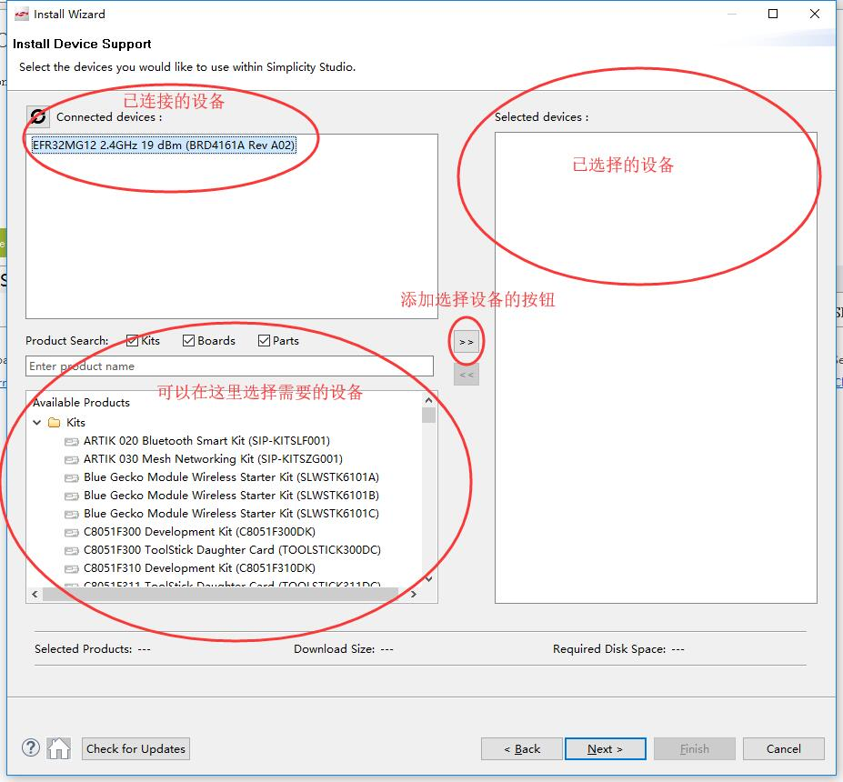
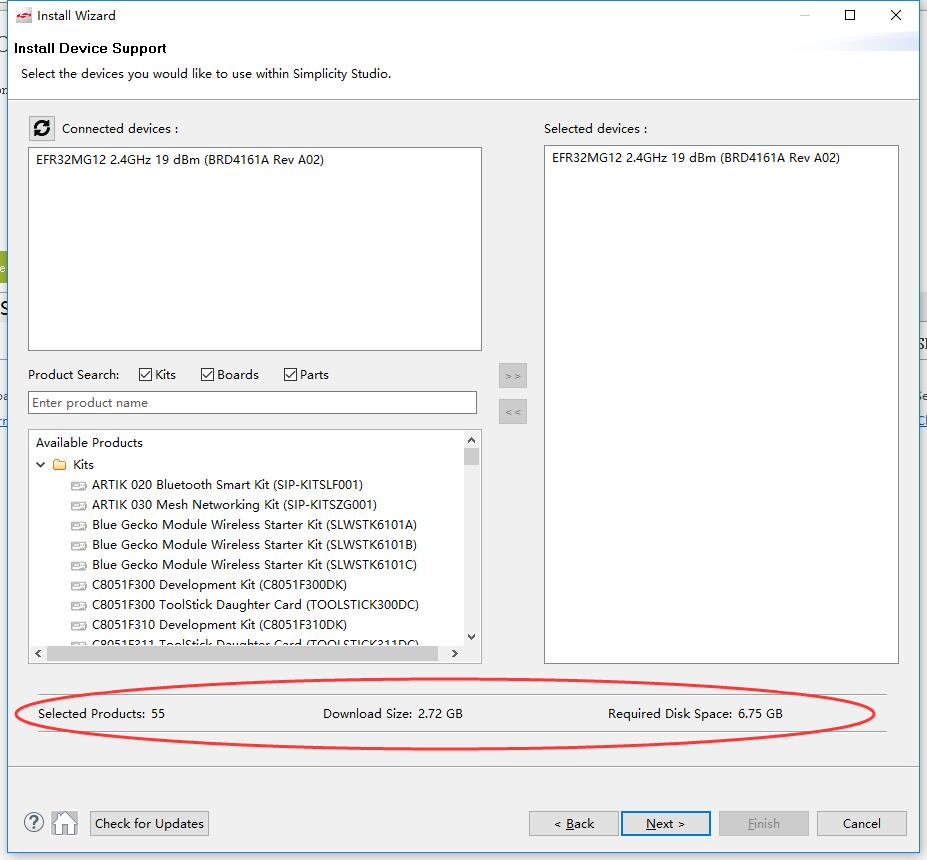
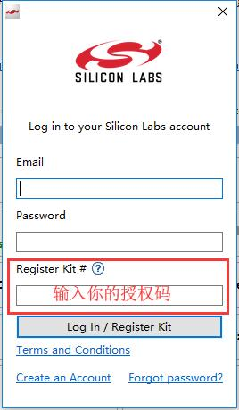
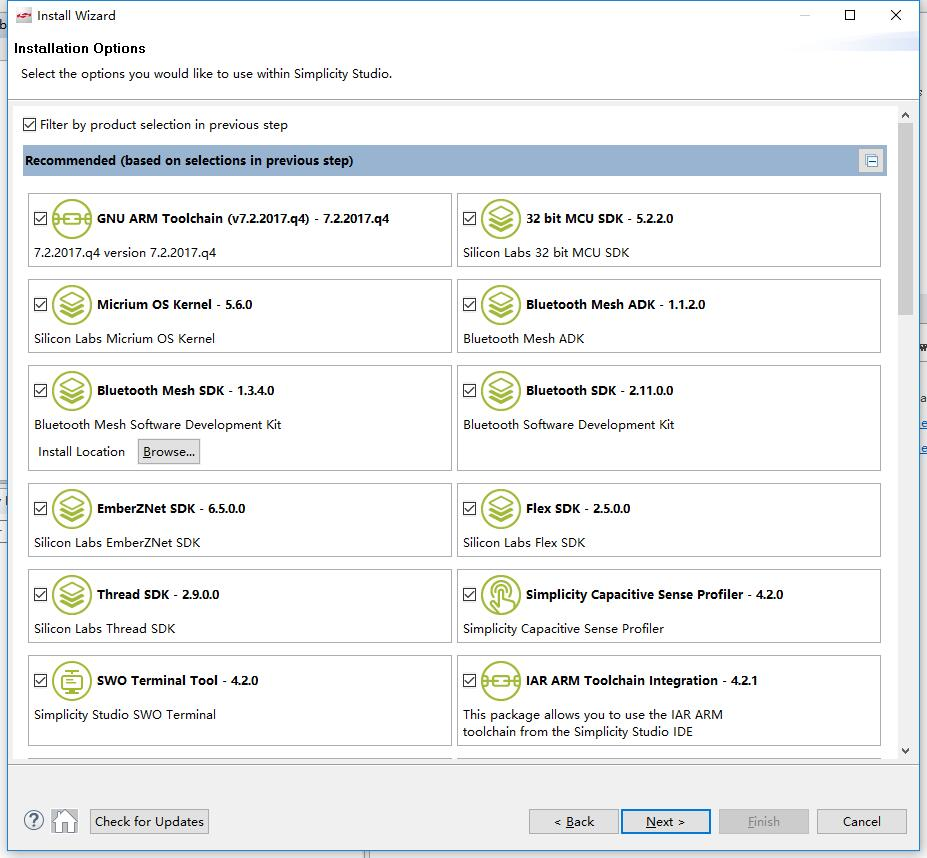
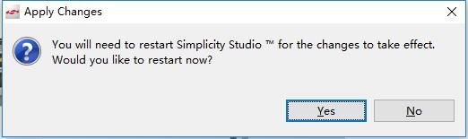

# 安装 Simplicity Studio 和 EmberZNet

本文介绍了 Simplicity Studio 和 EmberZNet 的安装过程。

# 1. 下载安装包

Simplicity Studio 的安装包可以从 Silicon Labs 的官方网址：[https://www.silabs.com/](https://www.silabs.com/) 中找到。如下图所示，点击 `Software Downloads`，即可在里面找到 Simplicity Studio。

> 提示：你也可以直接访问 [https://www.silabs.com/products/development-tools/software/simplicity-studio](https://www.silabs.com/products/development-tools/software/simplicity-studio)（注意，该地址可能会更新）来更快地找到 Simplicity Studio 的下载地址。

Silicon Labs 的官方网址中没有提供 EmberZNet 的下载地址，因为 EmberZNet 只能从 Simplicity Studio 中安装，并且需要授权才能安装。

# 2. 安装 Simplicity Studio

1. 下载完安装包后，双击安装包以安装 Simplicity Studio。在出现下图所示的提示框时，选择同意。然后一直点击 `Next`，直到安装完成。

    > 注意：最好不要更改默认的安装路径，因为 Simplicity Studio 或 SDK 的一些文件使用的是绝对路径。

    

2. 安装程序结束后会自动启动 Simplicity Studio，并且弹出如下登陆提示框：

    

    输入你的 Silicon Labs 账号，并按下 `Log In` 来登陆到 Simplicity Studio。

此时，已成功地安装 Simplicity Studio。

# 3. 安装 EmberZNet

1. 登陆账户后，Simplicity Studio 会弹出 `Installation Manager` 窗口，请点击 `Install by Device`。

    

2. 在弹出的 `Install Device Support` 窗口后，请根据下图的文字提示来操作。

    

3. 选择好设备后，`Install Device Support` 窗口的下方会提示一些安装要求，如下图所示。确认满足安装要求后点击 `Next` 继续。

    > 注意，安装资源包需要联网下载，因此在安装期间切勿断开网络。

    

4. 此时，会弹出一个如下图所示的窗口。

    

5. 留意你的 “EmberZNet (zigbee)” 项是否为 “Access Granted”。如果该项为 “Register Kit”，则点击 `Register Kit` 以获取安装权限；如果拥有访问权限，则点击 `Next`。

    > 提示：已购买了官方无线开发套件（如 EFR32 Mighty Gecko Starter Kit）的用户，可以从包装盒中获取授权码；你也可以咨询官方客服/代理商来了解授权码获取的途径。

    

6. 在弹出的 `Installation Options` 窗口中，选择你要安装的组件（如无特别需求，默认即可），然后点击 `Next`。

    

7. 在弹出的 `Review Licenses` 窗口中，点击 `Accept All`，然后再点击 `Finish`。

    

8. Simplicity Studio 会自动安装刚才所选的组件（如下图所示），等待安装完成即可。

    

9. 安装完成后会弹出 `Apply Changes` 提示框，点击 `Yes`，Simplicity Studio 将会自动重启并加载已安装的组件。

    

至此，你已经成功地安装了 Simplicity Studio 和 EmberZNet。
