# 网络分析仪入门指南

本文通过 EmberZNet 示例应用（Z3Light 和 Z3Switch）来简单地介绍网络分析仪的基本操作。本文假设您已经阅读了 [使用 App Builder 构建 EmberZNet 示例应用](../build_emberznet_sample_application_with_app_builder/doc.md)。在进行本文的实践之前，你需要构建 EmberZNet 示例应用：Z3Light 和 Z3Switch，并下载到你的官方无线套件设备上）。

# 1. 打开网络分析仪工具

Simplicity Studio 自带网络分析仪工具，可以非常方便地进行网络抓包和数据包分析。

官方无线套件支持包跟踪接口（PTI，Packet Trace interface）功能（示例应用默认打开了此功能），这使得无线设备可以充当嗅探器的角色，而无需专门的嗅探器。

> 注：本节所述的设备为装载 Z3Light 示例应用的设备。

如下图所示，在 `Debug Adapters` 视图中，右键设备并选择 `Connect`，以连接设备。

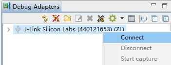

然后，右键已连接的设备并选择 `Start capture`，以进入网络分析仪界面（Live）和开始捕获网络数据包。

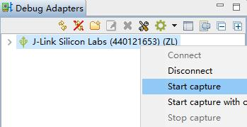

网络分析仪界面（Live）图示：

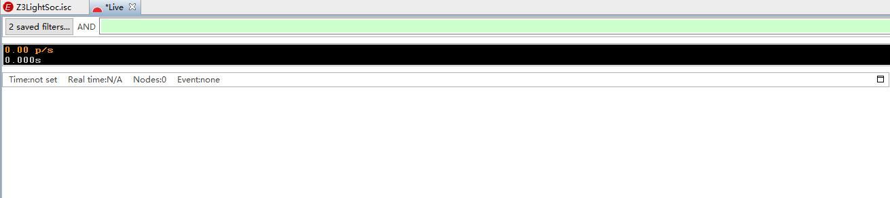

现在，你应该可以看到图示中的界面。

> 注：如果你的界面中并非如图示一样空白，那么你的设备可能在某个网络里。此时，你需要将设备离开网络以更好地进行后续的实践，离网操作可以参考 [使用 CLI 进行基本网络操作](../use_cli_for_basic_network_operation/doc.md)。

# 2. 添加解析数据包时需要的网络密钥

> 注：本节所述的设备为装载 Z3Light 示例应用的设备。

首先，开始设备的捕获功能，然后打开设备的控制台。您可以拖拽视图来改变视图的布局，以更方便地观察网络分析仪中的变化。

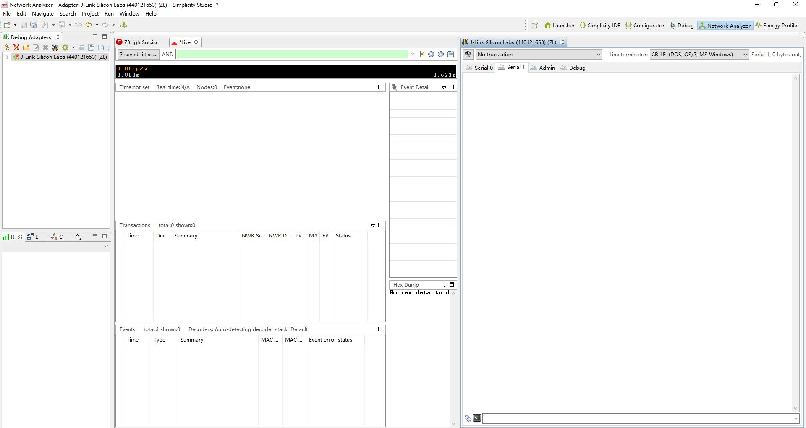

在控制台中输入 `plugin network-creator form 0 0x1234 19 12` 命令，以创建一个分布式安全网络。

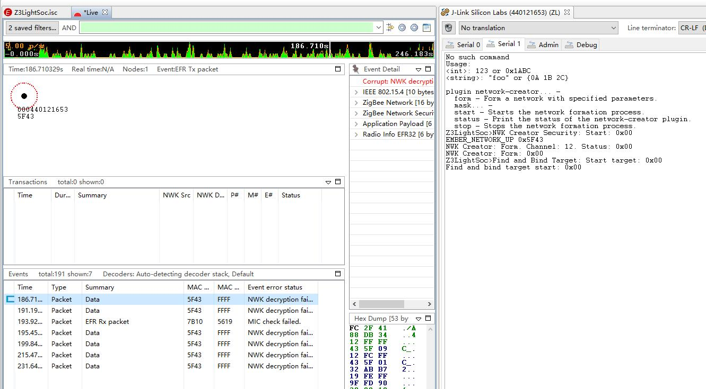

此时，可以看到控制台中打印出了设备创建网络时发生的行为，并且在网络分析仪的 `Events` 栏中也出现了一些数据包。你会发现，出现的数据包几乎都是显示为 `Data`，这是因为你没有正确的密钥，所以无法解析包的数据。

在控制台中输入 `key print` 以将网络密钥打印出来。

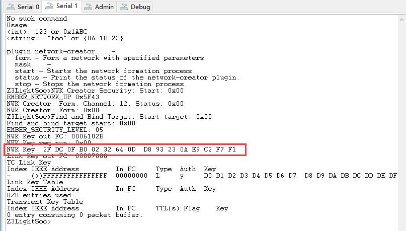

在 `Window` 菜单中选择 `Preferences`，在 `Preferences` 中找到 `Security Keys` 项，并在其中选择 `New` 来添加刚打印出的网络密钥。

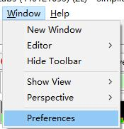

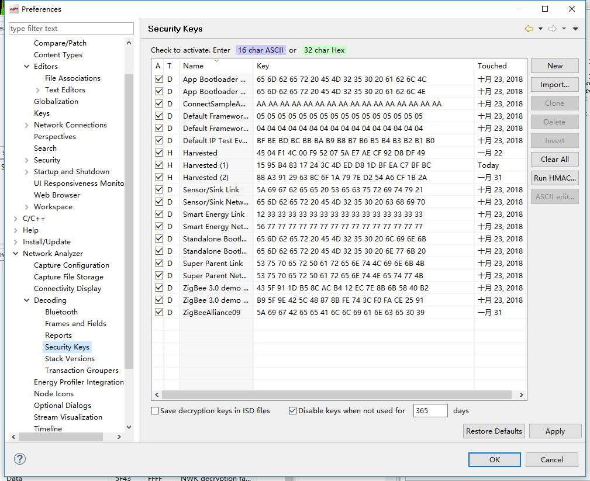

添加密钥后，按下 `Apply`，再按下 `OK`。

随后，你会发现网络分析仪的 `Events` 栏中的数据包被正确地解析。

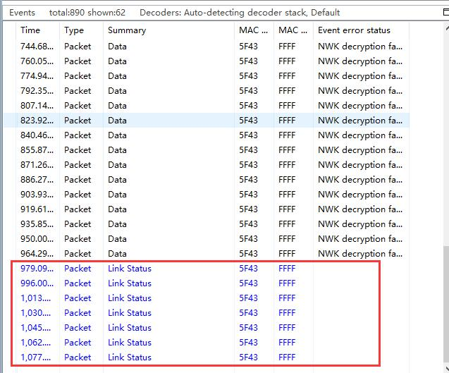

> 注：并非只有创建网络的节点才可以打印网络密钥。在 ZigBee 网络中，所有节点共享一个相同的网络密钥，因此只要节点设备成功地加入到网络中，它就可以打印出正确的网络密钥。

# 3. 利用网络分析仪观察设备入网行为

因为在上一节中，我们已经建立了一个分布式安全网络并且添加了该网络的网络密钥到网络分析仪的解密列表中，所以我们现在可以将另一个设备（Z3Switch）加入到该网络中，以观察其入网行为。

> 注：应该先检查 Z3Switch 是否在某个网络中，若然在，则离开这个网络以方便下述实践。

在 Z3Light 的控制台中输入 `network pjoin 180` 以开放网络 180 秒来允许其它设备加入。然后，在 Z3Switch 的控制台中输入 `plugin network-steering start 0` 来加入到网络。

在 Z3Switch 加入网络的过程中，你会发现网络分析仪界面发生了变化。

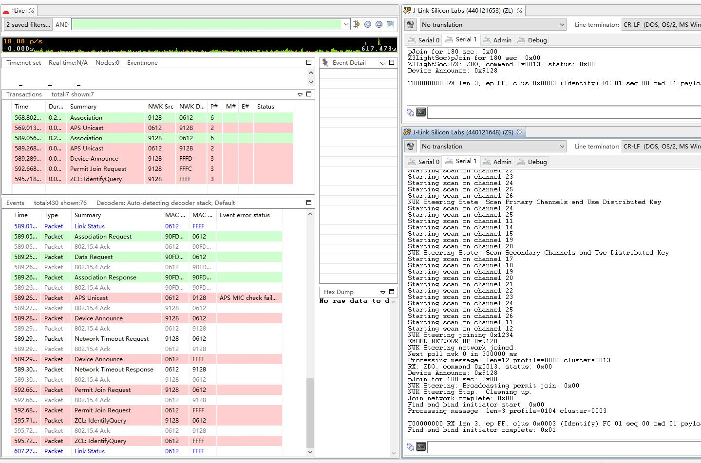

有时候，当网络中设备较多时，网络分析仪界面的变化较快，你可以点击停止按钮来暂停捕获以更方便地分析某个时间点的数据包。

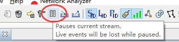

在 `Transactions`/`Events` 栏中点击某个条目，即可查看该条目的详细信息。

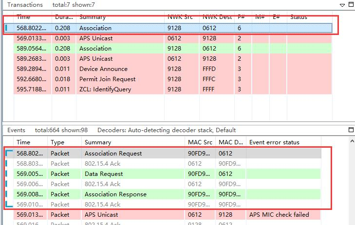

