# 安装 Simplicity Studio 和 EmberZNet

本文介绍了 Simplicity Studio 和 EmberZNet 的安装过程。

# 1. 下载安装包

Simplicity Studio 的安装包可以从 Silicon Labs 的官方网址：[https://www.silabs.com/](https://www.silabs.com/) 中找到。如下图所示，点击 `Software Downloads`，即可在里面找到 Simplicity Studio。

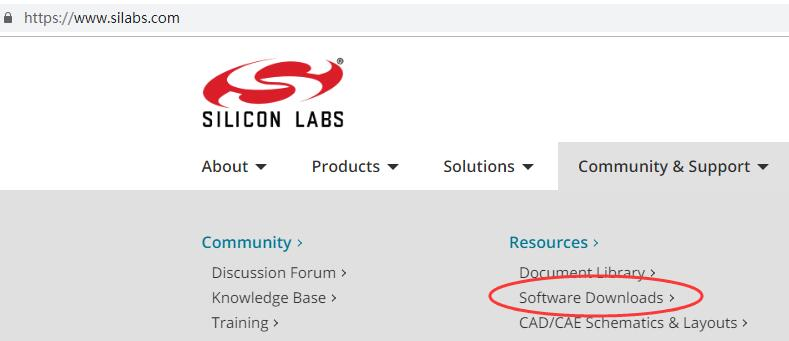

> 提示：你也可以直接访问 [https://www.silabs.com/products/development-tools/software/simplicity-studio](https://www.silabs.com/products/development-tools/software/simplicity-studio)（注意，该地址可能会更新）来更快地找到 Simplicity Studio 的下载地址。

Silicon Labs 的官方网址中没有提供 EmberZNet 的下载地址，因为 EmberZNet 只能从 Simplicity Studio 中安装，并且需要授权才能安装。

# 2. 安装 Simplicity Studio

下载完安装包后，双击安装包以安装 Simplicity Studio。在出现下图所示的提示框时，选择同意。然后一直点击 `Next`，直到安装完成。

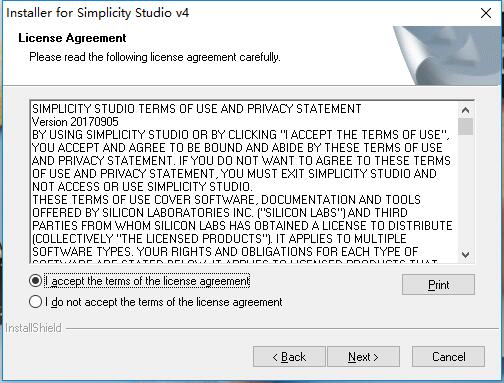

> 注意：最好不要更改默认的安装路径，因为 Simplicity Studio 或 SDK 的一些文件使用的是绝对路径。

安装程序结束后会自动启动 Simplicity Studio，并且弹出如下登陆提示框：

这时，输入你的 Silicon Labs 账号，并按下 `Log In` 来登陆到 Simplicity Studio。

# 3. 安装 EmberZNet

登陆账户后，Simplicity Studio 会弹出下图所示的安装管理器选项框：

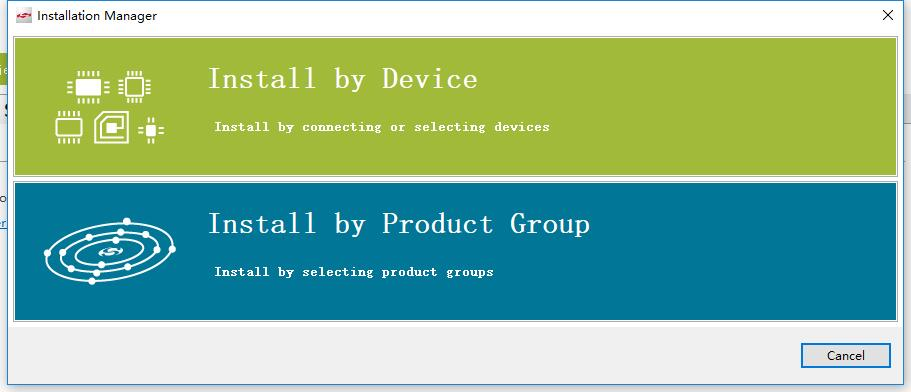

这里（建议）选择：“Install by Device”。

选择后，会弹出一个设备选项框，你可以根据下图的文字提示来操作：

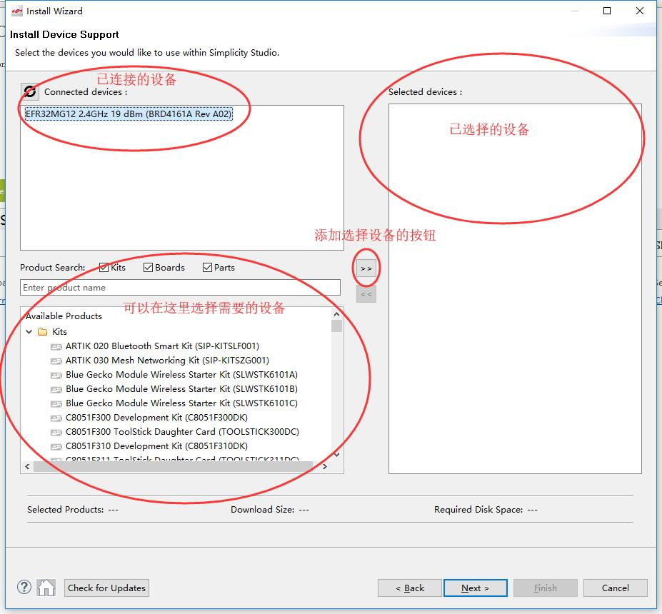

选好设备后，设备选项框的下方会提示一些关于安装的要求，如下图所示：

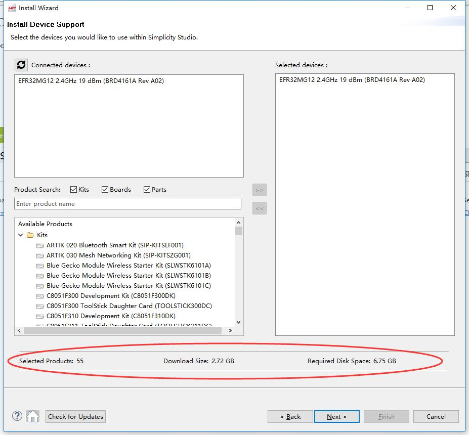

确认满足安装要求（注意，安装需要下载一些包，因此需要联网）后，点击 `Next`。此时，会弹出一个如下图所示的选项框：

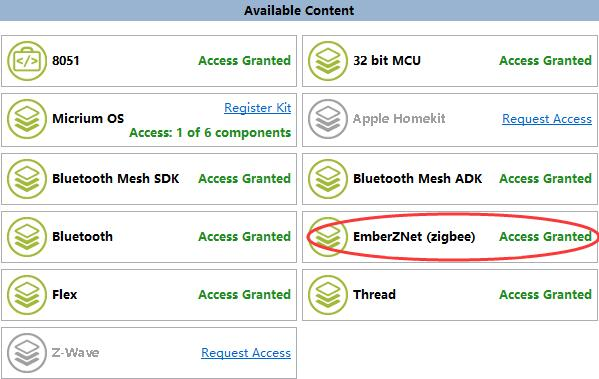

请留意你的 “EmberZNet (zigbee)” 项是否为 “Access Granted”。如果该项为 “Register Kit”，则点击 `Register Kit` 以获取安装权限：

> 提示：已购买了官方无线开发套件（如 EFR32 Mighty Gecko Starter Kit）的用户，可以从包装盒中获取授权码；你也可以咨询官方客服/代理商来了解授权码获取的途径。

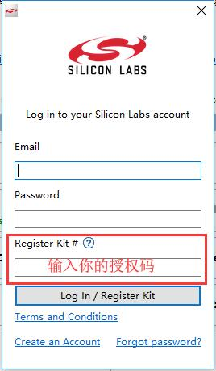

获取访问权限后，点击 `Next`。这时将进入到下图所示的安装选项框：

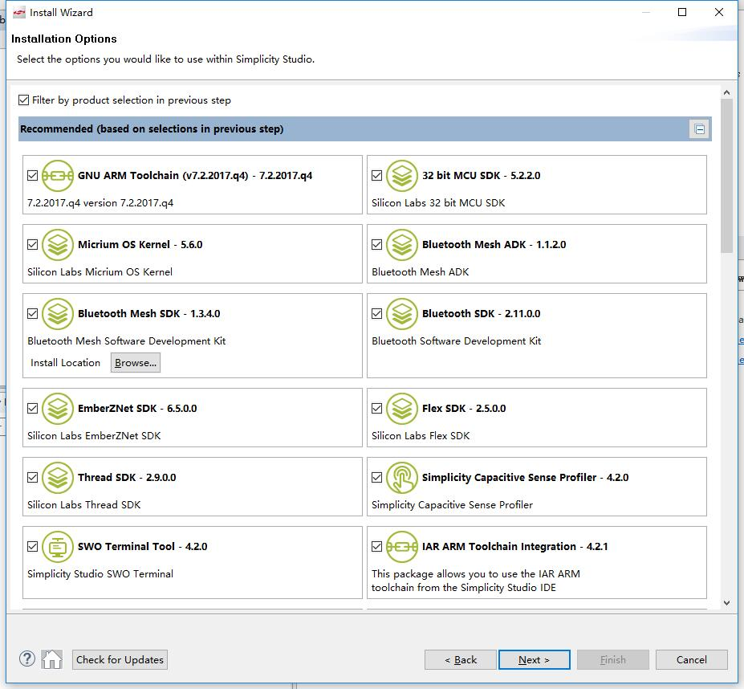

选择你要安装的组件（如无特别需求，默认即可），然后点击 `Next`。这时会弹出下图所示的许可选项提示框，点击 `Accept All`，然后再点击 `Finish`。

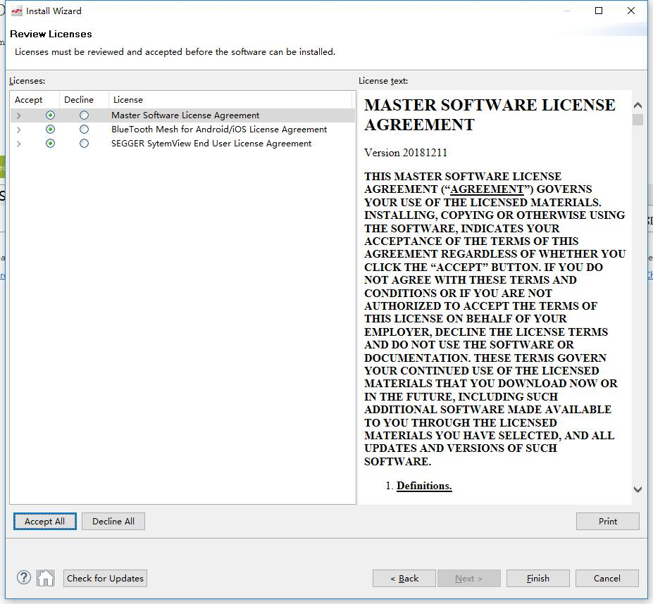

Simplicity Studio 会自动安装刚才所选的组件（如下图所示），等待安装完成即可。

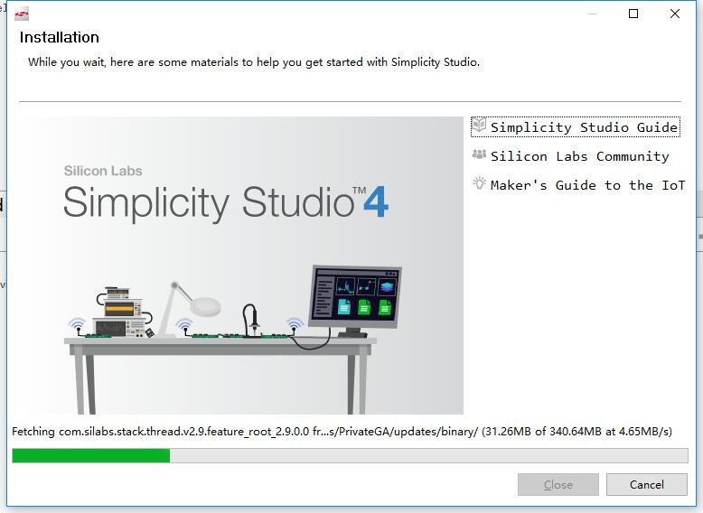

安装完成后会弹出一个提示框，点击 `Yes`，Simplicity Studio 将会重启并加载已安装的组件。

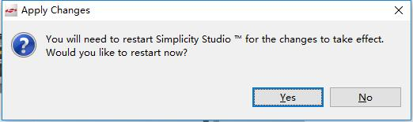

至此，你已经成功地安装了 Simplicity Studio 和 EmberZNet。
