# 使用 CLI 进行基本网络操作

本文通过 EmberZNet 示例应用（Z3Light 和 Z3Switch）来展示如何使用 CLI（Command Line Interface）进行基本的网络操作。EmberZNet 提供了一个可选的 CLI 功能，用户可以通过 CLI 与设备进行交互。本文假设您已经阅读了 [使用 App Builder 构建 EmberZNet 示例应用](../build_emberznet_sample_application_with_app_builder/doc.md)。在进行本文的实践之前，你需要构建两个 EmberZNet 示例应用：Z3Light 和 Z3Switch）。

# 1. 在 Simplicity Studio 中打开控制台

1. 打开 Simplicity Studio，并点击主界面右上角的 `Simplicity IDE` 按钮：

    <div align=center title="Simplicity IDE">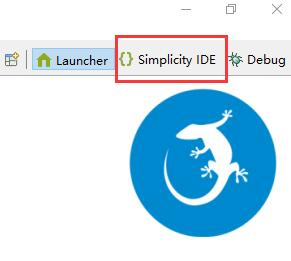</div>

2. 在 `Debug Adapters` 窗口中，右键要打开控制台的设备，然后点击 `Launch Console...`：

    <div align=center title="Launch Console...">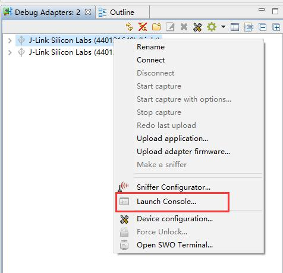</div>

这样，控制台将会被打开，你可以看到编辑界面中有一个控制台编辑页。

<div align=center title="Console">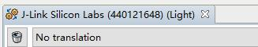</div>

# 2. 使用 CLI 创建/离开网络

本节使用 `Z3Light` 示例来演示操作，请先打开 `Z3Light` 设备的控制台。

1. 点击控制台界面中的 `Serial 1`，以切换到示例应用的 CLI 通信端口（VCOM）：

    <div align=center title="Serial 1">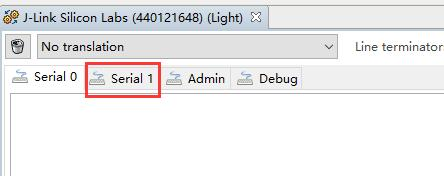</div>

2. 此刻，`Serial 1` 中可能是空白的，也可能有文字输出，你可以在输入框中按下回车键，然后 `Serial 1` 将会输出 CLI 提示符：

    <div align=center title="Z3LightSoc">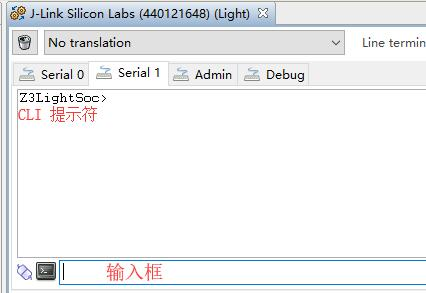</div>

3. 使用 `info` 命令，将设备的一些信息打印出来：

    <div align=center title="info">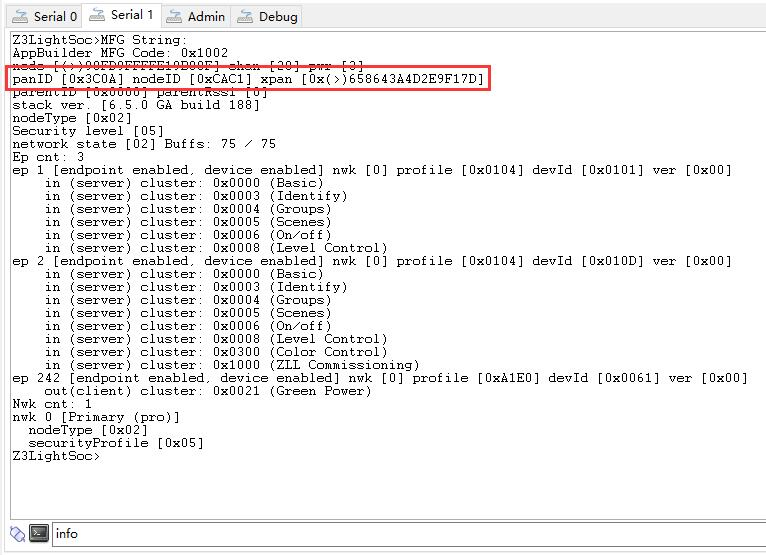</div>

4. 可以看到，你的设备已在网络中；若你的 `Serial 1` 输出的信息为：`panID [0x0000] nodeID [0xFFFE] xpan [0x(>)0000000000000000]`，则表示你的设备并不在网络中，请跳过本步骤。<br />使用 `network leave` 命令，使设备离开网络：
   
    <div align=center title="network leave">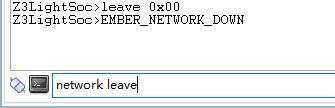</div>

5. 使用 `plugin network-creator form` 命令，创建一个网络：

    <div align=center title="plugin network-creator form">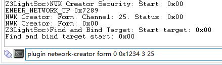</div>

    `plugin network-creator form` 命令的参数说明如下：

    ```
    Plugin network-creator form (args) 
        <uint8_t>   Whether or not to form a centralized networ ...
        <uint16_t>  PanID of the network to be formed
        <int8_t>    Tx power of the network to be formed
        <uint8_t>   channel of the network to be formed
    ```
    
    由于 `Z3Light` 示例应用的设备类型为 `Router`，因此在这里选择不形成 `centralized network`。
    
    > 注意：在你还没了解 ZigBee 的基础知识前，前使用本文给出的参数，以避免操作失败。

    > 提示：此时，你可以使用 `info` 命令来打印信息，以比较操作前后之间的差异。

# 3. 使用 CLI 加入网络

本节使用 `Z3Light` 和 `Z3Switch` 示例来演示操作，请先打开 `Z3Light` 和 `Z3Switch` 设备的控制台。并且，请确保你的 `Z3Light` 设备已经成功形成一个网络；若未形成网络，请参照第二节的创建网络操作。

1. 在 `Z3Switch` 的 `Serial 1` 中使用 `info` 命令，已查看其是否在网络中：

    <div align=center title="info">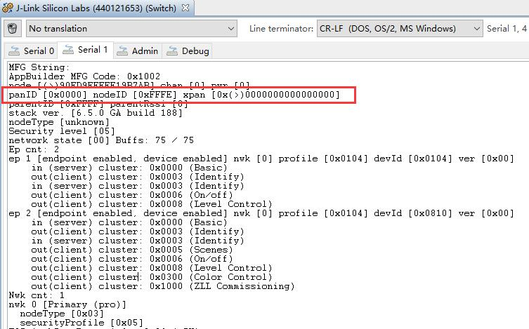</div>

    可以看到，其不在网络中。若你的 `Z3Switch` 在网络中，则请使用 `network leave` 命令，使设备离开网络。

2. 在 `Z3Light` 的 `Serial 1` 中使用 `network pjoin` 命令来开放网络，使 `Z3Switch` 能够加入到 `Z3Light` 的网络中：

    <div align=center title="network pjoin">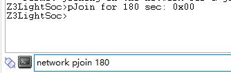</div>

    其中 `network pjoin` 命令的参数如下：

    ```
    network pjoin (args) 
        <uint8_t>  Number of seconds during which devices will be allowed to join the net ...
    ```

3. 在 `Z3Switch` 的 `Serial 1` 中使用 `plugin network-steering start` 命令，以使用网络转向加入到 `Z3Light` 的网络中：
   
    <div align=center title="plugin network-steering start">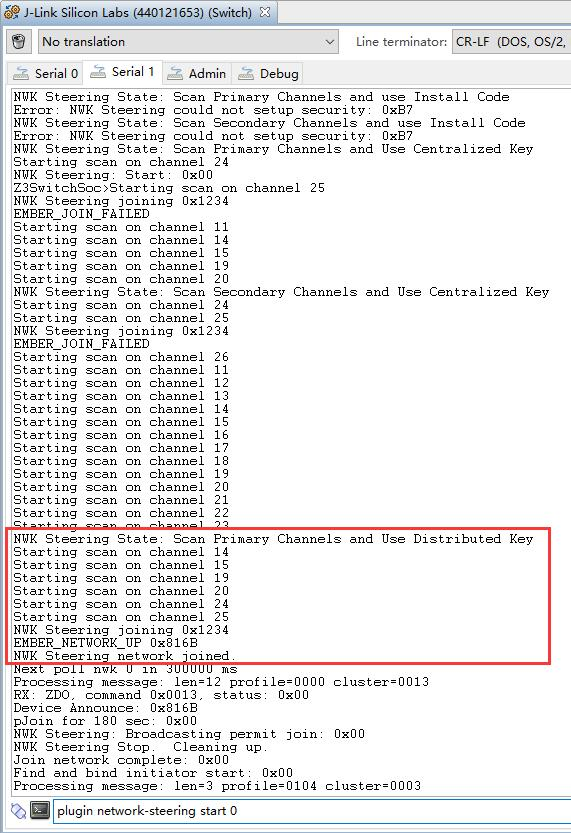</div>

    `plugin network-steering start` 命令的参数如下：

    ```
    plugin network-steering start (args) 
        <uint8_t>  A mask of options for indicating specific behavior within the network- ...
    ```

    可以从上图看出，`Z3Light` 会扫描给定的信道，并尝试加入到许可加入的网络。此处，`Z3Light` 使用了 `Distributed Key` 加入到 `Z3Light` 的网络中。

# 4. 使用 CLI 控制开发套件上的 LED

本节使用 `Z3Light` 和 `Z3Switch` 示例来演示操作，请先打开 `Z3Light` 和 `Z3Switch` 设备的控制台。并且，请确保 `Z3Light` 已创建网络，而 `Z3Switch` 已加入到 `Z3Light` 的网络中。

`Z3Switch` 充当一个开关设备，而 `Z3Light` 充当一个灯。你可以使用以下的命令来控制灯（开发套件的底板上的 LED0）：

* `zcl on-off on` - 开
* `zcl on-off off` - 关
* `zcl on-off toggle` - 切换

在使用上述任一命令后，将在设备上填充好一个 ZCL 命令，但并未发送出去，此时应使用 `send` 命令来发送填充好的命令。

`send` 命令的参数如下：

```
send (args) 
    <uint16_t>  short id of the device to send the message to
    <uint8_t>  The endpoint to send the message from
    <uint8_t>  The endpoint to send the message to
```

以开灯动作为例，你需要执行以下步骤：

1. 在 `Z3Switch` 的 `Serial 1` 中使用 `zcl on-off on` 命令，以填充一个 ZCL 命令：

    <div align=center title="zcl on-off on">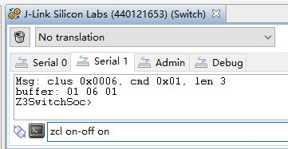</div>

2. 在 `Z3Light` 的 `Serial 1` 中使用 `info` 命令，以获取 `Z3Light` 的网络短地址（此处为 `0x7289`）：

    <div align=center title="info">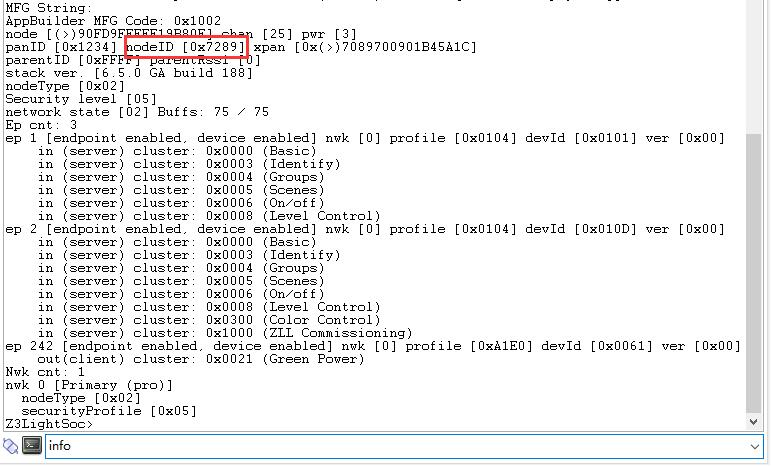</div>

3. 在 `Z3Switch` 的 `Serial 1` 中使用 `send` 命令，以将已填充好的 ZCL 命令发送到 `Z3Light`：

    <div align=center title="send">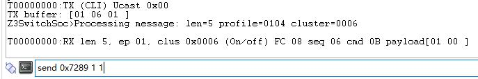</div>

    这时，你可以看到 `Z3Light` 的 `Serial 1` 中输出了接收信息，并且能看到其底板上的 LED0 亮起：

    <div align=center title="RX">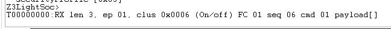</div>

你也可以尝试使用其它控制命令来控制灯的状态。

至此，你已经了解了一些基本的 CLI 命令。
